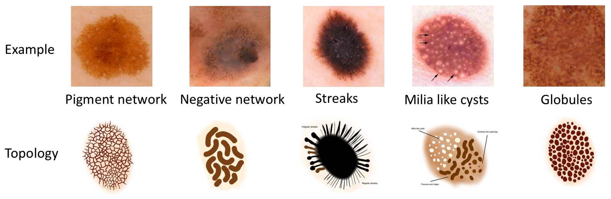
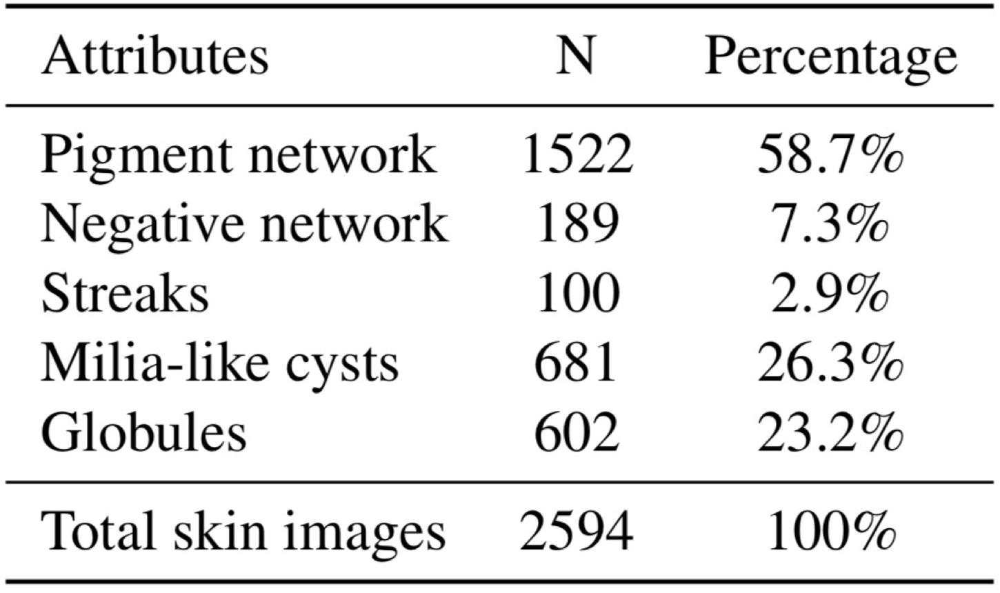
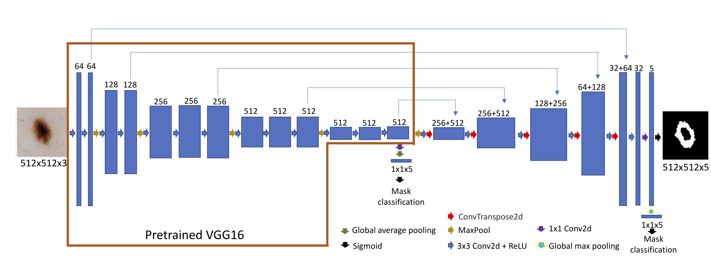
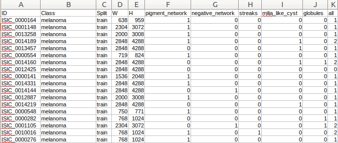

# Lesion attributes segmentation for melanoma detection with multi-task U-Net 

Melanoma is the most deadly form of skin cancer worldwide. Many efforts have been made for early detection of melanoma. The International Skin Imaging Collaboration (ISIC) hosted the 2018 Challenges to help the diagnosis of melanoma based on dermoscopic images. We describe our solutions for the task 2 of ISIC 2018 Challenges. We present a multi-task U-Net model to automatically detect lesion attributes of melanoma. The network includes two tasks, one is the classification task to classify if the lesion attributes present, and the other is the seg-mentation task to segment the attributes in the images. Our multi-task U-Net model achieves a Jaccard index of 0.433 on official test data of ISIC 2018 Challenges task 2, which is the best single-model result and ranks the 5th place on the final leaderboard.


## Introduction

Deep learning models have also been applied toclassify skin diseases and segment whole lesion regions. However, lesion attribution segmentation for melanomadetection has not been well explored. Automatic detection of those skin lesion attributes can be a tremendous help forearly melanoma diagnosis.  Towards this goal, the Interna-tional Skin Imaging Collaboration (ISIC) hosts a competitionto predict the locations of five skin lesion patterns (i.e., dermoscopic attributes) in dermoscopic images. These five pat-terns are pigment network, negative network, streaks, milia-like cysts, and globules.  These morphological pat-terns have been associated with clinical criteria for detectingskin disease. Below are examples of dermoscopic skin images and corresponding lesion attribute topology (figures from [https://challenge2018.isic-archive.com/](https://challenge2018.isic-archive.com/))

<p align="center">

</p>


We noticed that not all attributes present in each skin image. Below is a summary of non-empty masks in the training data. N is the number of non-empty masks. 58.7%, 26.3% and 23.2% of the skin images have non-empty masks for pigment network, milia-like cysts, and globules, respectively. While only 7.3% 2.9% of the skin images have non-empty masks for negative network and streaks, respectively. Since segmentation is essentially a pixel-wise classification problem, a large numberof empty masks increase the number of samples in negative class.

<p align="center">

</p>


Examples of skin images and corresponding lesion attributes. For each attribute, the top row is the ground truth masks and the bottom row is the predicted masks from multi-task U-Net model. Note that many of the ground truth masks are empty, indicating no corresponding lesion attributes in the skin images.

<p align="center">

</p>

We develop a multi-task U-Net model to automatically detect lesion attributes of melanoma.  In the U-Net model, we replace the encoder part of the U-Net with a pretrained VGG16 network.  We further extend the model based on multi-task learning.  In the middle layer and the last layer of the U-Net, we add two classification heads to classify the empty masks versus the non-empty masks.  One classification head is added to the middle layer with a 1×1 convolutional layer followed by a global average pooling layer and the other is added to the last layer with a global max pooling layer. The experiment results show that the extra ancillary classification task indeed improves the performance of the segmentation task.  Without any model ensemble, our multi-task U-Net model achieves a Jaccard index of 0.433 on official test data, which is the best single-model result. 

<p align="center">

</p>

The loss is a combination of pixel-wise segmentation loss loss1, classification loss using the middle layer loss2 and classification loss using the last layer loss3.

loss = loss1+ 0.5×loss2 + 0.5×loss3

## How to run the pre-trained model on the ISIC2018 test data

### Step 1: Set up environment

#### If you want to use conda 

#### 1. Create a Python environment
```
conda create -n isic2018 python=3
source activate isic2018
```

#### 2. Install necessary packages
```
pip install -r docker/requirements.txt
```
Those are the packages installed in my environment and many packages are not necessarily needed to run the pretrained model. But for ease of use, I just dumped all the installed packages into one file.

#### 3. Clone this repo
```
git clone https://github.com/chvlyl/ISIC2018.git
cd ISIC2018
```

#### If you want to use docker

#### 1. Install docker
```
## make sure you have the latest nvidia driver

## for Ubuntu
curl -fsSL https://download.docker.com/linux/ubuntu/gpg | sudo apt-key add -
sudo add-apt-repository "deb [arch=amd64] https://download.docker.com/linux/ubuntu  $(lsb_release -cs)  stable" 
sudo apt-get update
sudo apt-get install docker-ce

## start docker
sudo systemctl start docker
sudo systemctl enable docker

## check if docker is running
sudo systemctl status docker

## check docker version
docker --version

## add user to docker group 
## otherwise you may get the following error
## Got permission denied while trying to connect to the Docker daemon socket
sudo usermod -aG docker $USER
## may need to restart the system

# Add the package repositories
distribution=$(. /etc/os-release;echo $ID$VERSION_ID)
curl -s -L https://nvidia.github.io/nvidia-docker/gpgkey | sudo apt-key add -
curl -s -L https://nvidia.github.io/nvidia-docker/$distribution/nvidia-docker.list | sudo tee /etc/apt/sources.list.d/nvidia-docker.list

sudo apt-get update && sudo apt-get install -y nvidia-container-toolkit nvidia-container-runtime
sudo systemctl restart docker
```

#### 2. Build docker image

```
## Clone this repo
git clone https://github.com/chvlyl/ISIC2018.git
cd ISIC2018

## build docker image
cd docker
docker  build -t isic2018 .

## create a docker container and mount the git folder
cd ..
docker run --gpus all --rm -v $(pwd):/ISIC2018/ \
           --user $(id -u):$(id -g) --name isic2018 \
           -e "HOME=/ISIC2018" \
           --ipc=host -it isic2018  bash
```

### Step 2: Download data and model weights

#### 4. Download the ISIC2018 test images
All the ISIC2018 test images are in jpg format. Save those images into a folder. You may need to replace the download link below with the new link. 
```
gdown challenge_test_data_download_link -O data/test.zip
unzip data/test.zip -d data/
```

#### 5. Download the pretrained model weights
The trained model weights can be downloaded [here](https://drive.google.com/drive/folders/1oxA7AXwnIug2H91r_49qthekz6UP47rc?usp=sharing). Or you can use gdown to donwload it.
```
gdown https://drive.google.com/uc?id=1NsJot5e7umEp5fp_NRqUCB30Sk2MJLOX -O model/model.pt
```

### Step 3: Run the model

#### 6. Run the pretrained model on test data
```
python3 submission.py --image-path data/ISIC2018_Task1-2_Test_Input --model-weight model/model.pt --output-path prediction
```
By default, the predicted masks will be saved in the prediction folder


## How to train the model on the ISIC2018 data

### Step 1: Download and pre-process the training data

#### 1. Download ISIC2018 training data
You may need to replace the download link below with the new link.
```
gdown challenge_train_image_data_download_link -O data/train.zip
unzip data/train.zip -d data/
gdown challenge_train_mask_data_download_link -O data/train_mask.zip
unzip data/train_mask.zip -d data/
```

#### 2. Split the official training data into training and validation
I have already split the data and the information is in `data/train_test_split.csv` and `data/train_test_split.pickle`. The format is as following:

<p align="center">

</p>

If you don't want to use my split, you need to prepare a file in this format and save it into a pickle file.

#### 3. Merge masks from five attributes into one matrix and normalize the images. Each of processed image will be saved into a hd5 file.
```
python3 preprocess.py --train-test-split-file ./data/train_test_id.pickle \
        --image-path ./data/ISIC2018_Task1-2_Training_Input/ \
        --mask-path ./data/ISIC2018_Task2_Training_GroundTruth_v3/ \
        --save-path ./data/task2_h5/
```

### Step 2: Train the model
```
python3 train.py --checkpoint checkpoint/1_multi_task_unet\
        --train-test-split-file ./data/train_test_id.pickle \
        --image-path ./data/task2_h5/ \
        --batch-size 4
```
The model will start to train and the results (tensorboard, model weights, etc.) will be saved into the checkpoint folder.


## Some notes
1. I trained the model with multi-GPUs. If you run my code on a single GPU, you may get an error about the parameter name mismatch. I think this is a bug in Pytorch and currently I don't have a good solution rather than manually modifying the parameter names (remove the 'module' prefix). 

Update: wrap the model as `nn.DataParallel(model)` and then load the multi-GPU model weights.

2. When I developed the model, I tried many different things. I commented out some code and kept them just in case you may be interested in trying them out. 

3. The data was not split based on task2. I was working with some friends and the original plan was to use the results from other tasks (1 and 3) to help my own task 2. So the data was split based on task1 (or task3) so that we had the same validation and test dataset. I could use the results from task1 or task3 to help my task. I would suggest you split the data by yourself according to this format in the pickle file. 


## Further improvement
1. I entered in this competition relatively late and I only had one month to work on it in part-time. Therefore, I believe many things can still be improved. Feel free to copy my code and work on it.


## Reference    
1. For more details, please check our paper:   
Lesion Attributes Segmentation for Melanoma Detection with Multi-Task U-Net. ([ISBI 2019](https://ieeexplore.ieee.org/document/8759483) ) ([bioRxiv 2018](https://doi.org/10.1101/381855))
2. My poster presented at ISBI 2019 ([ISBI_EZC.pdf](ISBI_EZC.pdf))
3. Some of the code was adopted from this [repo](https://github.com/ternaus/robot-surgery-segmentation)

